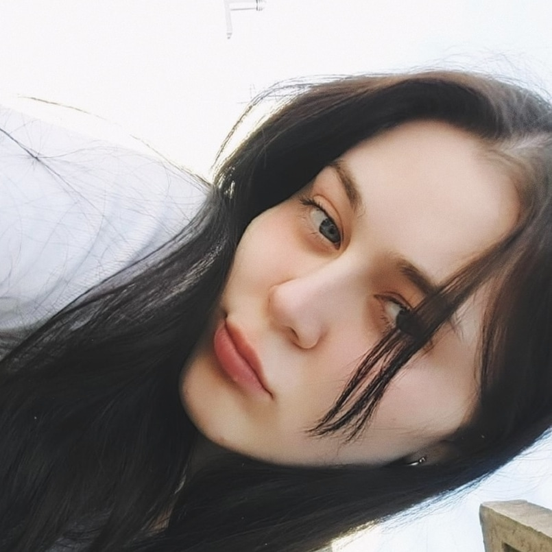
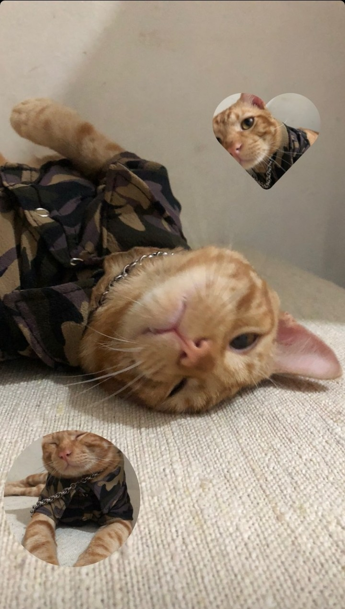

# Ximena Marchese
___

Mi nombre es Ximena pero suelen decirme **Xime** o **Toti** es mi cuarto cuatrimestre en la carrera estoy muy conforme porque me gusta mucho 
y anteriormente estuve en una crisis estudiantil sin saber que era lo que queria hacer, estudie por dos años medicina y deje la carrera ya que me 
di cuenta que no era lo que realmente me gustaba.

Me inscribi en la carrera de Programacion en el año 2022 despues de la pandemia, aprendi mucho y tambien me di cuenta de que quiero hacer esto por mucho tiempo.
Siempre me intereso el mundo de la tecnologia desde que soy chica.

Ademas de estudiar la Licenciatura en Programacion tengo muchos hobbies y actividades que me gusta hacer en mi tiempo libre.

## Mis Hobbies
___
+ Practico handball en la UnaHur
+ Escucho musica variada desde pop hasta musica clasica
+ Me gusta mucho leer
+ Recorrer museos de arte con mis amigas
+ Me atrae todo lo que tiene que ver con el arte y el diseño

 Vivo con mi gato, su nombre es Suga hace referencia a un rapero coreano de la banda bts que me gusta mucho, siempre lo visto con camisas y accesorios

